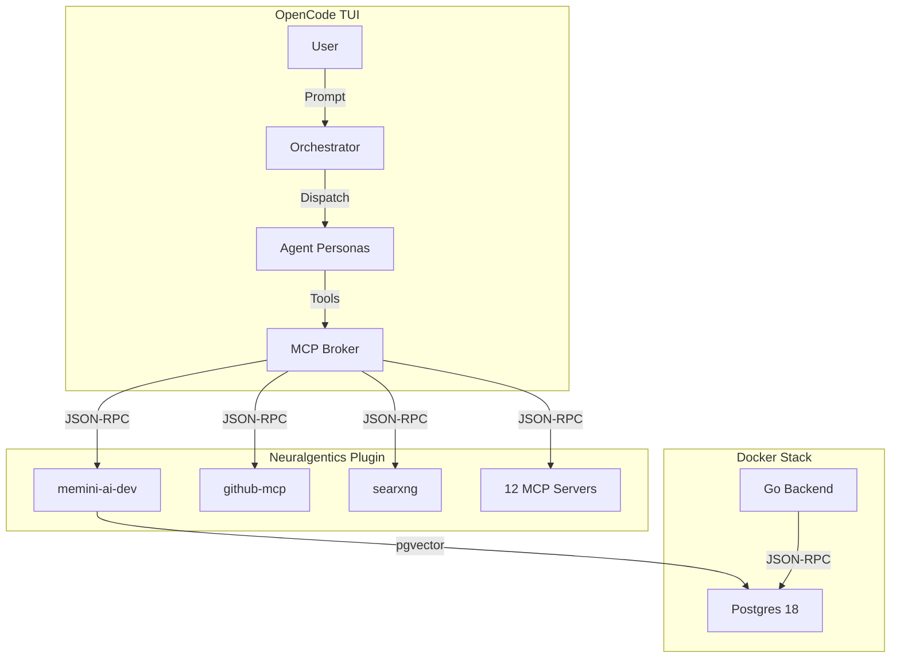

# Neuralgentics

> **Open-source agent runtime** — 12 MCP servers, 8 agent personas, 5 skills, 1 npm plugin, 3 containers, 1 stateless protocol, 0 lock-in.

- **12 MCP servers** — memini-ai, markitdown, duckdb, redis, playwright, calculator, prefect, mlflow-mcp, doc2png, github-mcp, videre-mcp, searxng
- **8 agent personas** — orchestrator, architect, coder, tester, linter, git, writer, mcp-specialist
- **5 skills** — kanban-board-manager, todo-list-updater, skill-self-audit, boomerang-agent-builder, mcp-specialist
- **1 npm plugin** — `@veedubin/neuralgentics` (340 KB)
- **3 containers** — postgres (1.2 GB), sidecar (180 MB), backend (26 MB)
- **1 stateless protocol** — MCP over JSON-RPC 2.0
- **0 lock-in** — MIT licensed, no telemetry, no mandatory cloud

Neuralgentics is the **agentic core** for [OpenCode](https://github.com/modelcontextprotocol/opencode) — a **skills broker**, **auto-evolving agent team**, and **memory engine** that turns any codebase into a **self-orchestrating workspace**.

## What's New

### v0.9.4: Plugin-only, container-safe, PyPI-free
- **Single install path**: `npx @veedubin/neuralgentics --init` — no more curl-bash, no more PyPI package
- **Container stack**: `docker compose up -d` brings up postgres, sidecar, and backend — no binary downloads, no systemd
- **Plugin architecture**: Neuralgentics is now an **OpenCode plugin** — installed via npm, not a standalone binary
- **Memory safety**: The Go backend runs in a container, not as a downloaded binary — no more `neuralgentics` CLI
- **Deleted**: PyPI package, TUI binary, `scripts/install.sh`, `packages/sdk/`, `packages/plugin/`, `packages/tui/`

## What it does

Neuralgentics provides **8 agent personas**, **5 skills**, and **12 MCP servers** that turn any codebase into a **self-orchestrating workspace**.

| Feature | What it does |
|---------|--------------|
| **Skills brokering** | Routes tasks to the best agent based on the [Routing Matrix](https://github.com/veedubin/neuralgentics/blob/main/AGENTS.md#routing-matrix) |
| **Auto-evolving agents** | Detects repeated processes and formalizes them as skills (via `skill-self-audit` and `boomerang-agent-builder`) |
| **Memory engine** | Tiered semantic memory with trust scoring, knowledge graph, and dialectic resolution (via `memini-ai-dev`) |
| **MCP broker** | Exposes 12 MCP servers (memini-ai, github-mcp, searxng, etc.) as tools to agents |
| **Kanban-native** | Tracks work in `TASKS.md` as a kanban board (via `kanban-board-manager`) |
| **Tiered context** | Auto-injects L0 (~100 tokens) and L1 (~2K tokens) summaries at session start |
| **Multi-agent routing** | Dispatches tasks to the correct agent based on the [Routing Matrix](https://github.com/veedubin/neuralgentics/blob/main/AGENTS.md#routing-matrix) |
| **Stateless protocol** | MCP over JSON-RPC 2.0 — no state, no lock-in |

## Quick links

| Resource | Link |
|----------|------|
| **Docs** | [neuralgentics.veedubin.com](https://neuralgentics.veedubin.com) |
| **Source** | [github.com/veedubin/neuralgentics](https://github.com/veedubin/neuralgentics) |
| **License** | [MIT](https://github.com/veedubin/neuralgentics/blob/main/LICENSE) |
| **npm** | [`@veedubin/neuralgentics`](https://www.npmjs.com/package/@veedubin/neuralgentics) |
| **Changelog** | [CHANGELOG.md](https://github.com/veedubin/neuralgentics/blob/main/CHANGELOG.md) |

## Install

Neuralgentics is an **OpenCode plugin** — install it in your project with:

```bash
# In your project directory
npx @veedubin/neuralgentics --init
```

### What `--init` does

1. **Downloads** the latest release tarball from GitHub
2. **Backs up** your existing `.opencode/` directory (if any)
3. **Merges** the plugin's `.opencode/` directory with yours (preserves your agents, adds Neuralgentics tools and personas)
4. **Updates** `.opencode/opencode.json` to include the plugin and its MCP servers
5. **Offers** to set up the container stack (`docker compose up -d`)
    - Skips if containers are already running (respects `.env`)
    - Uses `docker/postgres.Dockerfile` and `docker-compose.yml`
6. **Prints** next steps (e.g., `opencode` to start the TUI)

### Sidecar lifecycle

The embedding sidecar runs as a container with **lazy-load by default** — the model is only loaded into memory when you issue your first embedding call, and unloads after 5 minutes of inactivity. This means the sidecar costs ~80MB of RAM when idle, vs ~1.3GB when the model is loaded.

- **Default embedding model**: **BGE-M3** (1024-dim, multilingual, 8K context, ~1.1GB VRAM @ FP16). BGE-Large is still available via `--embed-model bge-large` for backwards compat (English-only, 512 token context, ~670MB VRAM).
- **Default (lazy)**: Model loads on first request, unloads after 5 min idle. Cold load takes 2-15s.
- **`--no-lazy-load` (eager)**: Model loads at startup, stays loaded while clients are connected.
- **`--quantize {fp32|fp16|int8}`**: Pick precision. INT8 is ~4x smaller, FP16 is ~2x smaller than FP32. Quality loss is <1% for BGE-M3.
- **Status endpoint**: `curl http://localhost:50052/status` shows `{loaded_models, last_used, dtype, device, embedding_model}`.

### When to use which

- **Laptop / shared machine**: Lazy + int8. Zero idle cost, slight cold-load wait.
- **Workstation / server**: `--no-lazy-load` + fp16 (GPU) or int8 (CPU). Always ready.
- **Cluster / homelab**: Lazy + fp16/int8. Multiple clients share one sidecar.

The sidecar has no per-project state — one instance serves all your projects.

### Multi-model RRF (v0.12.0+)

The memory backend supports storing and querying memories embedded with different models simultaneously. New `embedding_bge_m3 vector(1024)` and `embedding_bge_large vector(1024)` columns exist alongside the original `embedding vector(384)` column. When you query, RRF (Reciprocal Rank Fusion) merges top-k results from each populated column automatically. No user action required.

### Manual install (alternative)

Add `@veedubin/neuralgentics` to your `.opencode/opencode.json` `plugins` array:

```json
{
  "plugins": [
    "@veedubin/neuralgentics"
  ]
}
```

Then run `opencode` to load the plugin.

### Container stack

The memory backend runs as a **3-service Docker stack** (postgres, sidecar, backend). To start it:

```bash
cd neuralgentics
cp .env.example .env  # Edit if needed
docker compose up -d
```

- **Postgres**: TimescaleDB + pgvector (port `6200`)
- **Sidecar**: Python FastMCP server (port `6001`)
- **Backend**: Go JSON-RPC memory server (port `6002`)

The Go backend connects to Postgres on `localhost:6200` by default (configurable via `.env`).

## Architecture at a glance



## Container stack

Neuralgentics v0.7.0+ runs the memory backend as a **3-service Docker stack** (postgres, sidecar, backend).

| Service | Image | Port | Purpose |
|---------|-------|------|---------|
| **Postgres** | `veedubin/neuralgentics-postgres:0.9.4` | `6200:5432` | TimescaleDB + pgvector for memory storage |
| **Sidecar** | `veedubin/neuralgentics-sidecar:0.9.4` | `6001:6001` | Python FastMCP server for memini-ai tools |
| **Backend** | `veedubin/neuralgentics-backend:0.9.4` | `6002:6002` | Go JSON-RPC memory server (MCP tools) |

To start the stack:

```bash
cd neuralgentics
cp .env.example .env  # Edit if needed
docker compose up -d
```

The Go backend connects to Postgres on `localhost:6200` by default (configurable via `.env`).

## What ships

Neuralgentics v0.9.4 ships as an **npm package** (`@veedubin/neuralgentics`) with the following structure:

| Path | Purpose |
|------|---------|
| `overlay/packages/opencode/` | npm package (`@veedubin/neuralgentics`) |
| `overlay/packages/opencode/src/cli.ts` | CLI entry point (`neuralgentics --init`) |
| `overlay/packages/opencode/src/server.ts` | OpenCode plugin entry |
| `overlay/packages/opencode/src/neuralgentics/` | Internal modules (init, download, merge, orchestrator, routing) |
| `overlay/packages/opencode/dist/` | Compiled output (shipped) |
| `overlay/packages/opencode/.opencode/` | Bundled agent personas, skills, AGENTS.md |
| `packages/backend-go/` | Go source for the JSON-RPC memory server |
| `docker/postgres.Dockerfile` | Postgres 18 + pgvector + TimescaleDB image |
| `docker-compose.yml` | 3-service stack: postgres, sidecar, backend |
| `mkdocs.yml` + `docs/` | Documentation source |

## 30-second pitch

Neuralgentics turns any codebase into a **self-orchestrating workspace**.

1. **Install**: `npx @veedubin/neuralgentics --init`
2. **Start**: `docker compose up -d` (or skip if already running)
3. **Run**: `opencode`
4. **Watch**: Agents auto-route tasks, evolve skills, and remember decisions

No lock-in, no telemetry, no mandatory cloud — just **12 MCP servers**, **8 agent personas**, and **5 skills** working for you.

## Development setup

### Prerequisites

- Node.js 20+
- Docker + Docker Compose
- Go 1.22+
- Python 3.11+
- `uv` (for Python tooling)

### Setup

```bash
# Clone the repo
git clone https://github.com/veedubin/neuralgentics.git
cd neuralgentics

# Install npm dependencies
npm install

# Build the Go backend
cd packages/backend-go
go build -o neuralgentics-backend
cd ../..

# Set up the container stack
cp .env.example .env  # Edit if needed
docker compose up -d

# Start OpenCode with the plugin
opencode
```

### Key commands

| Command | Purpose |
|---------|---------|
| `npm run build` | Build the npm package |
| `npm run test` | Run tests |
| `npm run lint` | Lint the codebase |
| `docker compose up -d` | Start the container stack |
| `docker compose down` | Stop the container stack |

## License

Neuralgentics is **MIT licensed**. See [LICENSE](https://github.com/veedubin/neuralgentics/blob/main/LICENSE).

## Versioning

Neuralgentics follows [semantic versioning](https://semver.org/). See the [migration guide](https://neuralgentics.veedubin.com/migration/) for breaking changes.