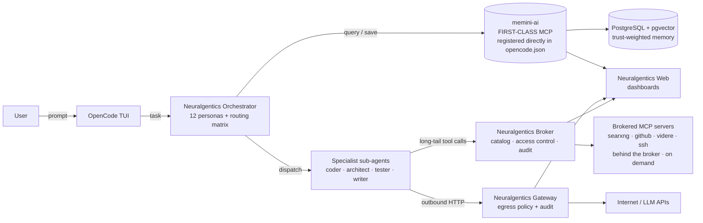

# Neuralgentics

> Agent orchestration for [OpenCode](https://github.com/sst/opencode) — 12 agent personas, 7 skills, 9 MCP servers, one plugin.

## Ecosystem

Neuralgentics is the **orchestration hub** for a modular agent ecosystem. The diagram below illustrates how Neuralgentics integrates with its sibling projects to provide a seamless, scalable, and secure agentic workflow:


memini-ai is a **first-class** MCP server — registered directly in `opencode.json` and always loaded. Every other MCP server sits **behind the broker**: catalog-advertised, access-controlled, and brokered on demand, which keeps long-tail tool schemas out of every prompt.


### Sibling Projects
- **[memini-ai-dev](https://github.com/Veedubin/memini-ai-dev)**: Trust-weighted semantic memory with PostgreSQL + pgvector backend. PyPI: [`memini-ai`](https://pypi.org/project/memini-ai/).
- **[neuralgentics-broker](https://github.com/Veedubin/neuralgentics-broker)**: MCP tool brokering, access control, and audit logging.
- **[neuralgentics-gateway](https://github.com/Veedubin/neuralgentics-gateway)**: Egress policy enforcement and audit for outbound HTTP requests.
- **[neuralgentics-web](https://github.com/Veedubin/neuralgentics-web)**: Dashboards for memory, broker, and gateway. PyPI: [`neuralgentics-web`](https://pypi.org/project/neuralgentics-web/).

## Features

Neuralgentics provides a **comprehensive, modular, and secure** agent orchestration platform:

### Orchestration
- **12 specialized agent personas**: Orchestrator, architect, coder, explorer, tester, reviewer, linter, git, writer, researcher, release, and agent-builder.
- **Routing matrix**: Enforces strict delegation rules to prevent context loss and ensure optimal agent selection.
- **Parallel dispatch**: Launches multiple sub-agents simultaneously for independent tasks, reducing latency.

### Memory Integration
- **memini-ai integration**: Trust-weighted semantic memory with PostgreSQL + pgvector backend.
- **Trust scoring**: Memories are scored based on usage and feedback, ensuring high-trust context is prioritized.
- **Tiered loading**: Efficient context management with L0 (~100 tokens), L1 (~2K tokens), and L2 (full context) summaries.
- **Knowledge graph**: Tracks entities and relationships for advanced reasoning and inference.

### Skills Brokering
- **Local + external skills**: Access to ~400 skills with provenance tracking, LRU caching, and auto-evolution gates.
- **Broker-mediated tool calls**: MCP tools are provisioned dynamically with access control and audit logging.
- **Token efficiency**: ~95% reduction in token usage by replacing inline ContextPackages with memory IDs.

### Broker
- **Tool audit**: Tracks MCP tool usage, access patterns, and anomalies.
- **Access control**: Fine-grained permissions for MCP tools and external APIs.
- **Provenance tracking**: Ensures all tool calls are traceable and reproducible.

### Gateway
- **Egress policy**: Enforces security and compliance for outbound HTTP requests.
- **Audit logging**: Tracks all external API calls for security and debugging.

### Web
- **Dashboards**: Real-time visualization of memory, broker, and gateway activity.

### Installer
- **Zero-Docker database**: Built-in PostgreSQL via `pgembed` — no Docker required.
- **Flexible initialization**: `--init-homedir` for global config, `--init-project` for project-specific setup.
- **Team server support**: Connect to shared PostgreSQL for collaborative memory.
- **Embedding model selection**: CPU, Auto (GPU-aware), or GPU modes for optimal performance.

## Quick Start

```bash
# 1. Install global config (provider, MCP servers, agents, skills)
npx @veedubin/neuralgentics --init-homedir

# 2. In your project directory, install project config + database
cd my-project
npx @veedubin/neuralgentics --init-project

# 3. Launch opencode (the installer offers to do this for you)
opencode
```

That's it. The built-in database (pgembed) needs zero Docker — it just works.

## What the installer does

### `--init-homedir`

Installs to `~/.config/opencode/` (Linux) or `~/Library/Application Support/opencode/` (Mac):

- **Provider config** — Ollama Cloud with 10 models pre-configured
- **9 MCP server templates** — videre-mcp enabled, rest disabled (enable what you need)
- **12 agent personas** — orchestrator, architect, coder, explorer, tester, reviewer, linter, git, writer, researcher, release, agent-builder
- **7 skills** — kanban-board-manager, todo-list-updater, skill-self-audit, orchestrator, handoff, external-skills-fetcher, update-gh-docs
- **7 slash commands** — `/handoff`, `/orchestrator`, `/kanban-board-manager`, `/skill-self-audit`, `/todo-list-updater`, `/update-gh-docs`, `/external-skills-fetcher`
- **AGENTS.md** — project instructions and agent protocol
- **Pre-downloads all MCP packages** via `uvx`/`npx` so first launch is fast

### `--init-project`

Installs to `./.opencode/` (or `--target <dir>`):

- **Plugin registration** — `@veedubin/neuralgentics` in the plugin array
- **memini-ai-dev MCP server** — enabled with your chosen database backend
- **Same agents, skills, AGENTS.md** as homedir (or project-specific overrides)
- **Database setup**:
  - **Built-in (pgembed)**: Zero Docker. Uses a local Unix socket — no username or password needed. Data stored in `~/.local/share/memini-ai/pgembed/data`.
  - **Team server**: Connects to a shared PostgreSQL. Asks for host, port, database name, username, and password. Saves credentials to `.env`. The installer does NOT probe or migrate the team database — it just writes the config. memini-ai auto-creates its tables on first launch. Make sure PostgreSQL is running before launching opencode (run `npx @veedubin/neuralgentics --db-start` if you need a local server).
- **Offers to launch opencode** when done

## Interactive Prompts

Running `npx @veedubin/neuralgentics --init-homedir` without skip flags walks you through:

1. **How should memini-ai store memories?**
   - `1. Built-in database` (recommended) — No setup needed, everything runs locally.
   - `2. Team server` — Connect to a shared PostgreSQL database for team memory.

## Team Server, RBAC, SSL, and Containers

memini-ai-dev supports team server mode with per-project PostgreSQL users, SSL/TLS, and container runtime detection.

**Default behavior**: All users have read/write/edit access to all memories (open by default). Per-project isolation is opt-in via `MEMINI_PEER_ENFORCEMENT=true`.

**For full documentation** on RBAC user management, SSL configuration, and container runtime setup, see the [memini-ai-dev README](https://github.com/Veedubin/memini-ai-dev#readme).

Neuralgentics inherits all of memini-ai-dev's team server capabilities. The `--team` flag during `neuralgentics --init-homedir` or `--init-project` passes through to memini-ai-dev's installer.

2. **Team server setup** (only if you chose team server) — connect-to-existing only:
   - Server IP/hostname (default: `localhost`)
   - Port (default: `6200`, matching the shipped `docker-compose.yml`)
   - Database name (default: `neuralgentics`)
   - Username (default: `neuralgentics`)
   - Password (you enter)
   - Save credentials to `.env`? (default: yes)
   - **Don't have a PostgreSQL server yet?** Run `npx @veedubin/neuralgentics --db-start` first — it ships a compose file + example env, brings the stack up, and offers to create your first database user. See the overlay README's "Team server mode (connect-to-existing)" section.

3. **What embedding model should memini-ai use?**
   - `1. CPU` — Fast and lightweight, runs on any machine.
   - `2. Auto` (recommended) — Same as CPU by default, can upgrade to higher quality if you add a GPU later.
   - `3. GPU` — Highest quality, but requires a dedicated GPU (NVIDIA CUDA or Apple Silicon MPS).

4. **Want to add your Ollama Cloud API key now?**
   - Get one at https://ollama.com (free tier available).
   - You can skip and add it later to `~/.config/opencode/.env`.

### System Dependencies

The installer checks for required tools before writing anything:

| Tool | Required for | Install |
|------|-------------|---------|
| **uv** | Python MCP servers (memini-ai-dev, videre-mcp, markitdown, duckdb) | `curl -LsSf https://astral.sh/uv/install.sh \| sh` (Linux) or `brew install uv` (Mac) |
| **node** | Node MCP servers (ssh-mcp, playwright, github-mcp, searxng, calculator) | https://nodejs.org/ |
| **npx** | Same as above (ships with Node.js) | https://nodejs.org/ |
| **libgl1** | videre-mcp vision (Linux only) | `sudo apt-get install -y libgl1 libglib2.0-0` |
| **libglib2.0-0** | videre-mcp vision (Linux only) | Same as above |

If any required tools are missing, the installer prints the install commands and exits. Nothing gets written until deps are satisfied. Missing ML libs (for videre-mcp) are non-blocking — everything else works without them.

## Flags

| Flag | Purpose |
|------|---------|
| `--init-homedir` | Install global config |
| `--init-project` | Install project config |
| `--init` | Alias for `--init-project` |
| `--update` | Update ALL installs (projects + homedir) |
| `--update-project` | Update just this project |
| `--update-homedir` | Update just the home dir |
| `--embedded` | Skip backend prompt, use built-in database |
| `--team` | Skip backend prompt, use team server |
| `--CPU-Embed` | Skip embedding prompt, use CPU mode |
| `--Auto-Embed` | Skip embedding prompt, use Auto mode |
| `--GPU-Embed` | Skip embedding prompt, use GPU mode |
| `--yes` | Skip all prompts (use defaults) |
| `--target <dir>` | Override install target directory |
| `--dry-run` | Print what would happen without writing anything |

## MCP Servers

9 servers are configured. All use `uvx` (Python) or `npx` (Node) so you get the latest version on each launch. Packages are pre-downloaded during install so first launch is fast.

| Server | Enabled by default | What it does |
|--------|-------------------|--------------|
| **memini-ai-dev** | Project only | Semantic memory, trust scoring, knowledge graph |
| **videre-mcp** | Homedir | Vision: OCR, image description (Florence-2 / PaddleOCR) |
| ssh-mcp-server | No | SSH remote command execution |
| markitdown | No | File conversion: PDF/DOCX/HTML to Markdown |
| playwright | No | Browser automation |
| github-mcp | No | GitHub repos, issues, PRs (needs `GITHUB_PERSONAL_ACCESS_TOKEN`) |
| duckdb | No | In-memory SQL via DuckDB |
| searxng | No | Web search (needs local SearXNG at `http://localhost:8080` — see [install docs](https://docs.searxng.org/admin/installation.html)) |
| calculator | No | Math evaluation |

Enable a server by editing your `opencode.json` and setting `enabled: true`.

## Agents

| Agent | Model | Role |
|-------|-------|------|
| orchestrator | kimi-k2.6 | Main coordinator, delegates to sub-agents |
| architect | deepseek-v4-pro | System design, trade-off analysis, research |
| coder | glm-5.2 | Fast code generation, bug fixes |
| explorer | devstral-2:123b | Codebase exploration, file finding |
| tester | deepseek-v4-flash | Test writing, test execution |
| reviewer | deepseek-v4-pro | Code review: logic, security, consistency |
| linter | qwen3-coder-next | Mechanical linting: ESLint, Ruff, mypy, tsc |
| git | minimax-m3 | Version control: commits, branches, tags |
| writer | mistral-large-3:675b | Documentation, markdown |
| researcher | qwen3.5 | Web research, data gathering, scraping |
| release | devstral-small-2:24b | Version bumps, changelogs, tagging |
| agent-builder | glm-5.2 | Pattern detection, skill/agent creation |

Model names in agent files use `ollama/<model>` format. To use a different provider, see the [provider switching guide](docs/providers.md).

## Cross-Platform

- **Linux**: `~/.config/opencode/` for global config
- **Mac**: `~/Library/Application Support/opencode/` for global config
- **Windows**: Use WSL (treated as Linux)

## Update

```bash
# Update everything (global + all projects)
neuralgentics --update

# Update just this project
neuralgentics --update-project

# Update just the home dir
neuralgentics --update-homedir
```

The update flow:
1. **Updates config files** — opencode.json, agent personas, skills, AGENTS.md from the latest release. Old files backed up to `opencode-bak/` before overwrite.
2. **Checks system dependencies** — offers to install missing system packages (same as init).
3. **Offers to refresh MCP packages** — re-downloads all MCP servers via `uvx`/`npx` so they're at the latest version.

Since we're not deleting (just moving to `opencode-bak/`), running from the wrong directory is safe.

## Manual install (alternative)

Add `@veedubin/neuralgentics` to your `.opencode/opencode.json` plugin array:

```json
{
  "plugin": ["@veedubin/neuralgentics"]
}
```

Then run `opencode` to load the plugin.

## Documentation

For full documentation, visit the [Neuralgentics Documentation Site](https://veedubin.github.io/neuralgentics/).

## Links

| Resource | Link |
|----------|------|
| Source | [github.com/Veedubin/neuralgentics](https://github.com/Veedubin/neuralgentics) |
| npm | [`@veedubin/neuralgentics`](https://www.npmjs.com/package/@veedubin/neuralgentics) |
| License | [MIT](https://github.com/Veedubin/neuralgentics/blob/main/LICENSE) |
| Documentation | [veedubin.github.io/neuralgentics](https://veedubin.github.io/neuralgentics/) |

## License

MIT licensed. See [LICENSE](https://github.com/Veedubin/neuralgentics/blob/main/LICENSE).