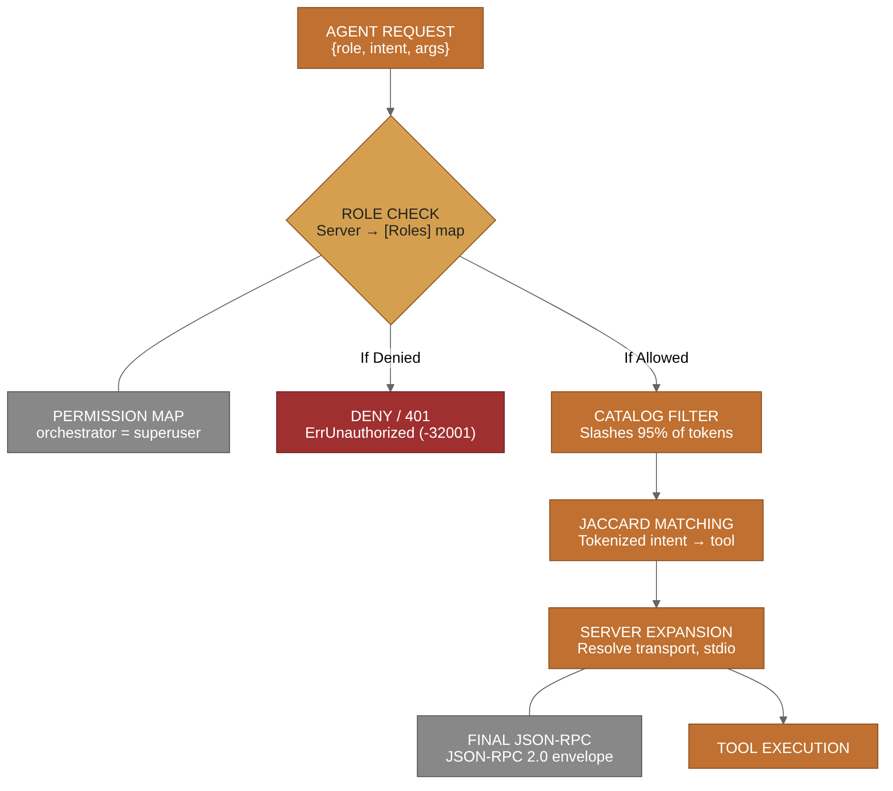

# Broker Flow

The Neuralgentics Broker is the strategic gatekeeper between the agent swarm and the external world. Its primary purpose is to enforce permissions and minimize token waste.

## ⚙️ The Gating Process

When an agent requests a tool, the Broker doesn't just check if the tool exists; it validates the *intent* and the *authority* of the requester.

View as PNG (better for some renderers)

> **Diagram 2 — Broker Permission Gating.** Every request undergoes a multi-stage validation process. First, the agent's role is checked against the server's allowed list. Then, the tool catalog is pruned to only relevant tools. Finally, Jaccard similarity is used to pinpoint the exact tool required before the JSON-RPC call is dispatched to the MCP server.

**Source:** [`diagrams/diagram-2-broker-flow.mmd`](diagrams/diagram-2-broker-flow.mmd) — edit the `.mmd` and re-run `npx mmdc -i ... -o ...` to regenerate.

---

## 🔍 Deep Dive: Key Mechanisms

### 1. Role-Based Access Control (RBAC)
The Broker maintains a map of `Server $\rightarrow$ [Roles]`. If a server is "restricted," only agents with a matching role can access it. The `orchestrator` role is a "superuser" and bypasses all restrictions.

### 2. Jaccard Intent Matching
To avoid the "Too Many Tools" problem in LLM prompts, the Broker uses Jaccard similarity on tokenized intent strings. This allows the system to:
1. Use a broad set of tools.
2. Only present the 3-5 most relevant tools to the agent for any given task.
3. Keep the prompt window lean and focused.

### 3. Server Expansion
When a tool is matched, the Broker "expands" the server. It resolves the server's actual MCP endpoint, handles the stdio transport, and wraps the request in the standard JSON-RPC 2.0 format.

### 4. Error Handling
If an agent attempts to access a restricted server, the Broker returns a `ErrUnauthorized` error (code `-32001`), which includes a suggestion of which servers that specific role *is* allowed to access.
