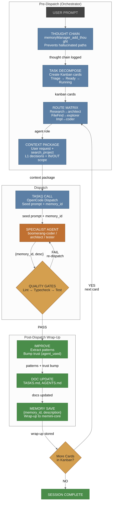

# Dispatch Flow

The Orchestrator is the "brain" of the session. It translates a vague user request into a deterministic set of tasks, ensuring no step is skipped and every agent has exactly the context it needs.

## 🔄 The Dispatch Pipeline

Neuralgentics does not use simple linear prompts. It uses a **decompositional pipeline**.

View as PNG (better for some renderers)

> **Diagram 3 — Dispatch Pipeline.** A user prompt flows through three lifecycle phases — pre-dispatch (orchestrator's thinking: thought chain → task decomposition → routing → context package), the dispatch itself (`task()` call → specialist agent → quality gates), and post-dispatch wrap-up (IMPROVE pattern extraction → doc update → memory save). If the kanban has more cards, the loop continues; otherwise the session is complete. Every edge is labeled with the data being passed (memory IDs, context packages, wrap-up handles).

**Source:** [`diagrams/diagram-3-dispatch-flow.mmd`](diagrams/diagram-3-dispatch-flow.mmd) — edit the `.mmd` and re-run `npx mmdc -i ... -o ...` to regenerate.

---

## 🛠️ Process Details

### 1. Thought Chain
Before acting, the orchestrator must "think." It uses `memoryManager_add_thought` to record its reasoning. This prevents "hallucinated paths" and allows developers to audit *why* a specific agent was chosen for a task.

### 2. Task Decomposition
The orchestrator transforms a prompt into a list of tasks in `TASKS.md`. 
- **Triage:** Initial sorting.
- **Ready:** Tasks deemed actionable.
- **Running:** The currently executing task.

### 3. The Routing Matrix
The routing matrix is a hard-coded rule set that prevents agent misuse. For example:
- `Research` $\rightarrow$ `boomerang-architect` (NOT explorer)
- `File Finding` $\rightarrow$ `boomerang-explorer` (ONLY glob/find)
- `Implementation` $\rightarrow$ `boomerang-coder`

### 4. The Context Package
To stay token-efficient, the orchestrator does not send a dump of all project files. It constructs a **Context Package** containing:
- The specific User Request.
- Relevant file snippets via `memoryManager_search_project`.
- Previous decisions from L1 memory.
- Defined boundaries (what is IN vs OUT of scope).
