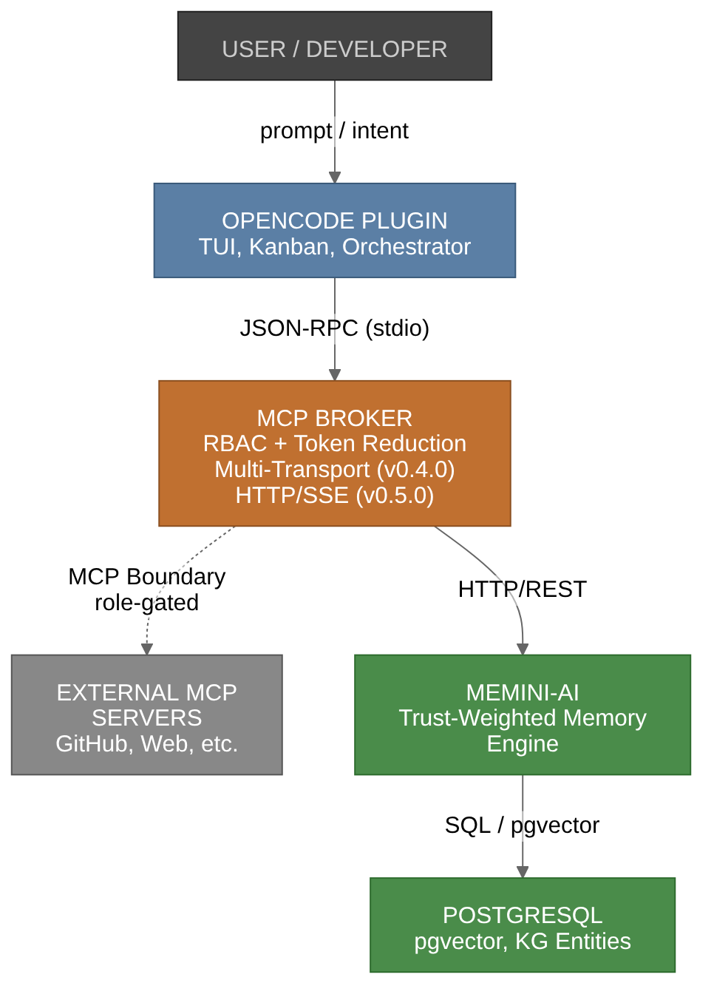

# System Overview

## The Harness
neuralgentics is the harness that turns a language model into a reliable agent. The harness consists of: the broker (tool permission enforcement), the memory engine (trust-scored persistence), the kanban (work decomposition), and the protocol (8-step mandatory lifecycle).

Neuralgentics is not a single application, but a coordinated runtime of three primary layers: the **Interface (OpenCode)**, the **Gatekeeper (Broker)**, and the **Brain (Memini-AI)**.

## 🏗️ High-Level Architecture

View as PNG (better for some renderers)

> **Diagram 1 — System Architecture.** The flow travels from the User through the OpenCode plugin. The Orchestrator manages the session logic, while the MCP Broker acts as a security and token-reduction gate for all external tool calls. The Memini-AI server handles the semantic "long-term" memory, backed by a vector-enabled PostgreSQL database.

**Source:** [`diagrams/diagram-1-overview.mmd`](diagrams/diagram-1-overview.mmd) — edit the `.mmd` and re-run `npx mmdc -i ... -o ...` to regenerate.

---

## 🧩 Component breakdown

### 1. The Interface (OpenCode Plugin)
The plugin integrates Neuralgentics into the IDE. Its primary responsibility is **Orchestration**. It decomposes user prompts into a graph of tasks and assigns them to specific agents using a routing matrix.

### 2. The Broker (Go Backend)
The Broker is the most critical security component. It implements **Role-Based Access Control (RBAC)**. 
- **Token Reduction:** Instead of sending a 100-tool catalog to every agent, the Broker filters the catalog based on the agent's role.
- **Intent Matching:** Uses Jaccard similarity to map agent intents to the most relevant tools.

#### v0.4.0 — Multi-Transport & Catalog
The Broker now supports a **multi-transport abstraction**, allowing MCP servers to declare multiple launch options (e.g., npx, uvx, local binary, docker, http) with automatic fallback chains. To simplify onboarding, the Broker ships with a curated catalog of 20 popular MCP servers embedded in the binary. Additionally, the system now supports runtime LLM provider switching between Ollama Cloud, Docker Model Runner (DMR), and OpenRouter.

#### v0.5.0 — HTTP Transport & Profile Sharing
v0.5.0 extends the transport abstraction to include **HTTP and SSE** for hosted MCPs (Cloudflare, Anthropic-hosted, etc.) — the new `HTTPClient` implements JSON-RPC over HTTP POST with optional Server-Sent Events for streaming responses. The Broker also gains a **profile export/import** subsystem: users can capture their active set (provider, MCPs, permissions, opencode snapshot) into a portable `tar.gz` file with optional HMAC-SHA256 signing, then re-apply on another machine. The TUI `/profile` command handles the round-trip. OCI registry push/pull is deferred to v0.5.1; v0.5.0 ships the `tar.gz` format only.

### 3. The Brain (Memini-AI)
Memini-AI is a semantic memory server. Unlike standard RAG, it uses a **Trust Engine**:
- Every memory begins with a trust score of $0.5$.
- Successful tool usage increases trust ($+0.05$).
- User corrections decrease trust ($-0.10$).
- This allows the orchestrator to prioritize "highly trusted" patterns over noisy ones.

---

## 🛠️ Tech Stack

| Component | Language | Key Technologies |
| :--- | :--- | :--- |
| **Backend/Broker** | Go | JSON-RPC, stdio, pgvector |
| **Memory Server** | Python | FastAPI, pgvector, Sentence-Transformers |
| **UI Overlay** | TypeScript | OpenCode Plugin API, React |
| **Database** | SQL | PostgreSQL 16+ |
